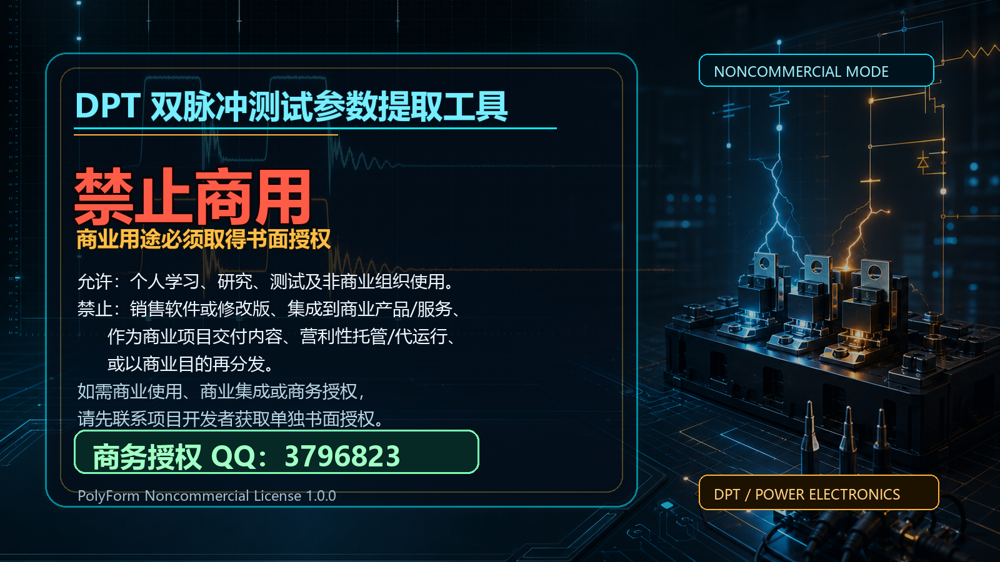

# DPT 双脉冲测试参数提取工具

从 Tektronix USB 示波器当前记录或 TSS 会话文件中的双脉冲测试（Double Pulse Test）与短路测试波形中，自动提取关断、开通、反向恢复、短路电流/能量/应力电压等参数，并提供与测试表格一致的分区 GUI 展示、Excel 导出和项目报告写入。



## v3.0.2 更新

- 所有关断、开通和反向恢复 `dv/dt`/`di/dt` 取值范围新增“自动最大斜率”：在各参数既有主沿内自动选择斜率最大且连续、单调、近似直线的有效区间，最终数值和 A/B 仍由原始波形真实交点计算；范围列显示实际自动结果，例如 `自动 46%→68%（14.2 ns）`。
- 原有百分比预设、自定义范围、默认值和 Top/Base 口径保持不变；反向恢复自动 `di/dt` 继续使用带符号 IDM 换流定义，不用噪声单点或数值导数峰值冒充测量区间。
- 修正斜率参数浮窗与横向光标浮窗被错误合并的问题：左侧原位置恢复显示完整 `|Ha-Hb|` 及 `|Ha-Hb|/|B-A|`，顶部 `Δt / 1/Δt` 旁新增参数范围浮窗，继续显示百分比 A/B 交点差值并与参数表同步；两套读数可同时观察。
- 修复软件处于局部放大状态时，点击水平标度栏右侧 `X` 只恢复软件全局视图、物理示波器仍停留在 Zoom 的问题；现在两端会同步退出局部放大。
- “最近局部放大/全图预览”按钮现在会同步控制 Tektronix `Zoom1`：切到全局时关闭 Zoom，切回局部时恢复同一软件窗口，不再需要在示波器上重复操作。
- 纯视图切换只同步 Zoom，不会在没有活动参数上下文时额外打开示波器光标；参数卡场景继续同步当前软件窗口及 A/B、Ha/Hb 光标。
- 同步仍通过示波器 Zoom 窗口完成，不修改主时基或完整记录；除用户主动选择“自动最大斜率”后的当前斜率范围外，本次不改变积分、Top/Base、默认百分比范围、默认光标落点或报告数值。
- 发布前完整测试为 `687 passed、86 skipped、389 subtests passed、0 failed`；默认与自动斜率模式分别重新扫描全部 `388` 个原始 TSS，均为 `failed=0、warnings=0`；两种模式的全量 GUI 光标审计均覆盖 `11041` 项且 `FAIL=0`。

## v3.0.1 更新

- 修复手动微调参数光标后，切换参数或执行非重置重算时，报告结果静默恢复为自动默认值的严重问题；仍有效的手动值现在会在界面、报告快照和 Excel 写入之间保持一致。
- 手动状态按波形源、双脉冲/短路模式及当前脉冲对隔离；斜率范围、短路 Tsc 范围或通道反相变化时，只失效对应缓存，避免跨波形、跨脉冲或跨定义串值。
- 短路 Imax 的数据行与报告图片工况在非重置重算后统一使用同一最终结果快照；未手调字段继续采用当前自动提取值。
- 真实 `UH_750V_1048A_000.tss` 验证中，Eon 从默认 `94.864 mJ` 手调为 `95.903 mJ`，切换参数、非重置重算并写入实际工作簿后仍为 `95.903 mJ`；未手调 Eoff 保持 `80.213 mJ`。
- 发布前完整测试为 `675 passed、86 skipped、383 subtests passed、0 failed`；全部 `388` 个原始 TSS strict 扫描为 `failed=0、warnings=0`。本次不改变默认参数计算、积分、斜率、Top/Base 或自动光标落点。

## v3.0.0 大版本更新

- 新增 Tektronix USB 示波器直读：读取当前完整记录、有效通道、Label、单位、刻度和 MATH 信息；Normal 触发模式下无需先按 Stop，当前记录即使不能生成 DPT 参数也仍会完整显示，TSS 保留为无示波器时的备用数据源。
- 软件参数局部窗口通过示波器 Zoom 同步，物理示波器继续保留全局概览；软件手动调整光标后，再次点击参数会按当前软件窗口和光标刷新一次示波器，而不会重新移动软件窗口。
- USB 读取优先按示波器 Channel Label 自动识别 U/V/W 相别、上下桥及 Vge/Vce/Ic/IL/Irr 等通道；已保存的手动映射优先，标签冲突或无法确定时保留人工调整入口。TSS 继续沿用原有“趋势优先、标签兜底”策略。
- 新增双脉冲与短路报告工况栏：电压、电流、Rg_on、Rg_off、Cg、Vce、Imax、Cdesat、Rdesat、Vdesat 按相别和上下桥独立记忆；TSS 识别到新值时覆盖，未识别或留空不阻止报告写入，短路 Imax 使用当前计算结果自动填写。
- 修正损耗参数稳定电压/电流平台中心、手动光标后二次点击不应重新局部放大，以及示波器式光标实际鼠标命中问题；参数公式、积分与斜率定义保持项目既有口径。
- 脉冲分段兼容每个连续 T1/T2/T3/T4/T5 高低电平段均不小于 `0.5 µs` 的工况，避免短段被合并、漏检或误判成单脉冲。
- 发布前完整测试套件 `735 tests、86 skipped、0 failed`；全部 `388` 个原始 TSS strict 扫描为双脉冲 `317`、单脉冲 `16`、短路 `55`，`failed=0、warnings=0`；GUI 全语料光标审计覆盖 `388` 个文件、`11041` 项，`FAIL=0`。
- 固定非商业用途授权海报未修改，SHA-256 保持 `0042390506059EE1DEEBE810B0BAE52C5F0C7B4BBB672910757659B10630A784`。

## v2.0.41 更新

- 修复低 `I_RM`、强振铃反向恢复波形的 `dv/dt` 与 `Err` 取值：`dv/dt` 改用事件内已稳定的电压平台，`Err` 在紧凑恢复段末端仍强振铃时有界延伸到真实尾部交点；其他波形继续沿用原有口径。
- `di/dt`、`dv/dt` 的“自定义…”窗口支持直接输入 `50%→70%` 等合法区间，并在算法、预设和自定义状态间切换时预留稳定尺寸，避免高 DPI 下输入区裁切及原生窗口几何警告。
- 参数表、默认光标、拖动光标后的顶部状态和波形浮窗统一复用同一测量上下文；`Err`、`Pdmax` 以及反向恢复斜率均按实际 A/B/Ha/Hb 重新核对。
- 以 `20260729` 项目报告的 `558` 个数据位为参考完成 `18` 份 LT/RT/HT 数据对照，并验证 `wanglihui` 目录 `92` 份数据；U 相 IRR 通道仅人工反相一次，避免缺参和二次反相。
- 发布前重新扫描 `388` 个原始 TSS，strict 结果 `failed=0、warnings=0`；GUI 全参数审计 `11041` 项、`FAIL=0`；分进程完整测试为 `643 passed、86 skipped、375 subtests passed`。
- 固定非商业用途授权海报未修改，SHA-256 仍为 `0042390506059EE1DEEBE810B0BAE52C5F0C7B4BBB672910757659B10630A784`。

## v2.0.40 更新

- 修复慢沿和延迟恢复样例在紧凑分段内缺少完整交点时，反向恢复 `di/dt`/`dv/dt`、开通 `dv/dt`、门极关断时间以及 Eoff 光标过早失效的问题；扩展搜索只在真实交点缺失时启用，不改变已有完整交点样例的默认计算。
- 反向恢复 `di/dt` 默认窗口统一按所选阈值完成区间取值，参数表、默认 A/B/Ha/Hb、拖动后的顶部状态和波形浮窗保持同源；`Err`、`Pdmax` 及开通/关断 ΔVce 光标窗口同步覆盖实际标记。
- 新增 `wanglihui/20260729` 语料布局和通道极性验证：UH 的 IRR 通道人工反相一次，UL 已经源/显示反相时不得二次取反。
- 发布前全部 `470` 个原始 TSS strict 扫描 `failed=0、warnings=0`；GUI 全参数审计 `13665` 项、`FAIL=0`；完整测试为 `659 passed、57 skipped、412 subtests passed`。
- 在 `1707×1019` 最大化源码窗口中完成 UH/UL 950A 真人验证，确认 `di/dt`、`dv/dt`、`Err`、`Pdmax` 的表格值、光标和浮窗同步；固定非商业用途授权海报保持不变。

## v2.0.39 更新

- `di/dt`、`dv/dt` 的“自定义…”改为在同一个取值范围窗口中直接输入起点和终点百分比，支持 `50%→70%` 等任意合法区间；预设、自定义和反向恢复 `di/dt` 算法切换保持一个窗口完成。
- 自定义百分比不再因输入顺序把关断或开通物理下降沿误判为上升沿；只重算当前斜率参数，其余已调整参数保持不变。
- 斜率参数表、默认光标及拖动后的浮窗统一使用同一组真实 A/B 交点；电流斜率浮窗以 `GA/s` 显示，与参数表的 `A/ns` 数值一一对应。
- 修复反向恢复 `di/dt` 在预设、自定义和零基准算法之间切换时的高 DPI 原生窗口几何警告，弹窗尺寸稳定且输入区不被裁切。
- 完整测试为 `647 passed、57 skipped、394 subtests passed`；全部 `359` 个原始 TSS 扫描 `failed=0`，并完成源码版真实桌面操作复核。
- 固定非商业用途授权海报继续保留在 README、PyInstaller 打包资源和首次启动弹窗中，本次发布不覆盖、不替换该海报资产。

## v2.0.38 更新

- 修复“先写入高温数据、用 Microsoft Excel 查看并保存报告、再写入常温数据”时，程序把自身温度身份保留名称误判为外部冲突并中止写入的问题。
- 报告新增 Excel 可稳定保留的隐藏温度身份 manifest；修复前报告经 Excel 保存后，只在 RT/HT/LT 三个隐藏工作簿级名称完整且值均为合法温度时安全迁移。
- 不完整、非隐藏、工作表级或值非法的同名名称仍会触发保护，避免为了兼容而覆盖错误温度数据；参数计算、光标逻辑、报告版式和图片逻辑均未改动。
- 固定非商业用途授权海报继续保留在 README、PyInstaller 打包资源和首次启动弹窗中，本次发布不覆盖、不替换该海报资产。
- 发布前完整测试结果为 `639 passed、57 skipped、394 subtests passed`，并通过本机 Microsoft Excel 打开、保存、退出后的报告续写实机验证。

## v2.0.37 更新

- 项目报告按实际温度自动确定写入位置，不再依赖各工况的测试或写入先后顺序：`0℃` 及以上按温度从低到高排列，`0℃` 以下按越接近 `0℃` 越靠上、温度越低越靠下排列。
- 每次写入前会先检测原有报告顺序；若旧报告已经乱序，会先对完整记录块做稳定排序，再把新记录插入正确位置。
- 排序同时覆盖“双脉冲数据/波形”和“短路数据/图片”，并同步保持图片、图表、合并单元格、行高和单元格样式与所属记录一致。
- 本次未改动参数计算与光标逻辑；发布前全量测试结果为 `637 passed、57 skipped、394 subtests passed`，固定非商业用途授权海报保持不变。

## v2.0.36 更新

- 修复小数电压/电流源文件名被 `Path.stem` 截断后，报告清理逻辑误删已经写入截图的问题；只有旧波形块的 V/I 身份能够被明确确认时才允许执行破坏性清理。
- 报告记录身份改为包含实际温度值：同一 RT/HT/LT 温区下的不同实际温度会保留独立数据行和波形截图，不再互相替换或覆盖。
- 报告剩余时间改用整任务分阶段历史模型，根据首次/后续写入、报告大小、图片数和结果行数估算；进度与真实阶段绑定，成功保存前保持在 `99.9%` 以下。
- 修复逐参数截图结束、进入 Excel 写入时，高 DPI 最大化窗口顶部残留总览图/标度栏空白的问题；恢复 ViewBox 后强制收敛布局，并跨一轮 Qt 事件循环再启动写入。
- 发布前已完成 `633 passed、57 skipped、394 subtests passed` 全量测试，并单独覆盖真实报告截图链、150% DPI 布局恢复和报告模板写入回归。

## v2.0.35 更新

- 纠正反向恢复 `Trr` 默认卡尺：`Hb` 使用有符号 `I_RM` 恢复尖峰，`Ha` 直接使用峰后恢复稳定波形最大/最小值的平均中线，A/B 使用同一逻辑 `Irr` 主瓣上升沿、下降沿与 `Ha` 的第一个真实交点。
- 修复高负载下桥 `Irr=Ic-IL` 工况把绝对值更大的负向前向电流平台误当成 `I_RM` 的问题；只有在明确负向高电流平台、后续正恢复瓣顺序正确且显著高于局部噪声时才选择小恢复瓣，避免换工况误选。
- 参数表、默认光标、手动光标、状态栏和报告继续复用同一 Trr 测量上下文；缺少真实双交点时明确显示不可用，不回退到半高、零电流、尾段外推或无关通道。
- 发布前重新覆盖 287 个原始 TSS、7809 个 GUI 参数卡和完整测试套件，并在最大化桌面窗口中复核点名 UH 数据及 LT 高负载下桥数据的 Trr/反向恢复 `di/dt` 光标来源与卡值。

## v2.0.0 大版本更新

- 新增短路测试模式，与双脉冲计算流程隔离，可提取短路电流 Imax、短路时间 Tsc、本管/对管短路能量 Esc、应力 Vpeak，并预留 Desat 动作时间识别。
- 短路模式支持独立通道默认值、Label 自动识别、参数表展示、波形标记、截图光标和短路测试 Excel 导出。
- 新增项目报告流程：可加载公司/项目报告模板、设置项目报告位置，并把数据和波形截图写入同一份报告。
- 内置公开兜底报告模板 `默认报告模板.xlsx`，私有模板只保存本机路径，不随开源包或 exe 发布。
- 优化工具栏窄屏布局、最近路径记忆和报告截图尺寸，让打包版在常用 Windows 笔记本上更稳定。

## 许可协议

本项目采用 [PolyForm Noncommercial License 1.0.0](LICENSE.md)。

允许个人学习、研究、测试以及非商业组织使用；未经版权方书面授权，禁止任何商业使用，包括但不限于销售本软件或修改版、集成到商业产品/服务、作为商业项目交付内容、提供营利性托管/代运行服务，或以商业目的再分发。

如需商业使用、商业集成或商务授权，请先通过 QQ `3796823` 联系项目维护者取得单独书面授权。打包版运行界面也会显示同样的非商业用途提示。

## v2.0.1 更新

- 运行界面新增非商业用途授权提示条，明确商业使用、商业集成、项目交付或商业目的再分发需先取得书面授权。
- 新增“商务授权”提示入口，商用需求可通过 QQ `3796823` 联系项目维护者。
- 重新打包 Windows exe，让授权提示进入实际发布程序。

## v2.0.2 更新

- 优化非商业用途授权提示：改为首次启动弹窗确认，不再长期占用主界面工具栏下方空间。
- 修正低电流与部分 SMC 工况下 Eoff A 光标的 Vce 基准平台识别，避免误落到 Vce 抬升脚点。
- 改进 Eoff 能量光标读数：A/B 光标同时显示 Vce 与 Ic 的采样值，并在波形上标记对应采样点。
- 修正 Irr 交互光标，使 Hb 跟随实际反向恢复电流尖峰，而不是被预尖峰或绝对值方向干扰。
- 缩短 GUI 光标审计默认样本集，并新增关键实测样本回归测试，方便发布前快速验证。

## v2.0.5 更新

- 新增固定非商业用途授权海报 `assets/noncommercial_authorization_poster.png`，并放在项目发布首页展示。
- 打包版首次运行时显示海报式授权提示；用户确认后写入本机设置，后续启动不再重复弹窗。
- PyInstaller 打包时内置同一张海报，确保 Release 程序与项目首页使用一致的授权提示。
- 该海报是固定发布资产，后续版本发布说明和首页应继续引用它，不得在常规发布更新中覆盖或替换。

## v2.0.6 更新

- 新增基于波形趋势的双脉冲通道自动识别：优先按 Vge/Vce/电流波形关系判断接线，标签异常时也能给出更可靠的映射。
- 保留 TSS Label 识别作为兜底，并新增 **按标签识别** 按钮，可在需要时强制按当前示波器 Label 重新生成映射。
- 优化通道映射交互：手动选择重复通道时优先保留当前编辑项，并自动交换或清空被挤占的逻辑通道，减少重复映射报错。
- 固定非商业用途授权海报继续保留在 README、PyInstaller 打包资源和首次启动弹窗中，本次发布不覆盖、不替换该海报资产。

## v2.0.7 更新

- 默认 Numba 编译缓存新增版本标记：新版本首次运行时会自动清理旧版本缓存并重建，避免旧缓存状态影响启动或 WFM/TSS 解析稳定性。
- 自定义 `NUMBA_CACHE_DIR` 保持原样，不主动清理用户显式指定的缓存目录。
- 打包版仍使用 `%LOCALAPPDATA%\DPT\numba_cache` 作为默认缓存位置，清理只发生在版本号变化后的第一次启动。

## v2.0.8 更新

- 修复 TSS 初次加载时能量 MATH 通道在 50 mJ/div 下按整条积分曲线居中，导致关键开关窗口挤出波形区的问题。
- 能量 MATH 的首屏垂直 fit 改为优先使用关断/开通开关窗口；参数计算、积分窗口、斜率和测量数值保持不变。
- 波形图元启用视区裁剪，窗口外积分尾段不会绘制到波形框外。

## v2.0.9 更新

- 修复两个损耗 MATH 通道默认加载后左侧 MATH 标识未贴合波形左缘的问题。
- MATH 损耗标识按首个损耗开关窗口起点对齐；普通电压/电流通道仍按自身 0 值参考显示。
- 仅调整波形标识显示层与拖动换算；参数计算、积分窗口、斜率、时间窗和数值结果保持不变。

## v2.0.10 更新

- 修正 v2.0.9 的 MATH 标识锚点处理：损耗 MATH 标识继续以 0J 基准显示，与示波器位置一致。
- 对 TSS 中由软件按公式补算出来的 J 单位损耗 MATH，忽略残留的 MATH 垂直刻度，改按完整损耗波形自动选择合适 V/div 档位。
- 首次加载时完整损耗曲线会落在波形界面 10%~90% 可用高度内；参数计算、积分、斜率、时间窗和数值结果保持不变。
- 固定非商业用途授权海报继续保留在 GitHub 首页、PyInstaller 打包资源和首次启动弹窗中，本次发布不覆盖、不替换该海报资产。

## v2.0.15 更新

- 修复通道映射、单位显示和通道反相状态在手动调整后的保持逻辑，参数计算按当前实时显示波形取值。
- 优化通道设置面板布局和偏移测量下拉显示，偏移测量现在使用当前 Math/反相后的实时波形计算并同步辅助线。
- 新增 Pmax/Pdmax 功率参数、报告模板列和功率波形局部查看；关断/开通命名为 Pmax，反向恢复 Pdmax 按绝对功率显示。
- 改进 Eoff/Eon/Err 右侧损耗光标定位，覆盖多脉冲导出/写入和相关回归测试。

## v2.0.16 更新

- 修复短路测试 `Vpeak_对管` 光标窗口：A/B/Hb 严格使用本管 Vge，Ha 和数值只取 A/B 范围内对管 `V_二极管` 最大值，覆盖上桥和下桥。
- `Tsc` 取值范围选择改为持久化记忆；用户不改动时，重启软件或重新加载文件后继续保持上次选择。
- 强化短路规范和回归测试，发布前已覆盖短路专项、GUI/提取测试、全量测试和 193 个 TSS 样例扫描。

## v2.0.17 更新

- 修复短路测试缺少对管波形时的自动通道映射：仅本管 `Vge`、本管 `Vce` 和 `Ic` 为必需项，`V_二极管`、对管 `Vge`、`Vdesat` 缺失时只影响对应参数。
- 非默认短路接线缺少对管波形时，本管短路参数继续提取，对管能量、对管应力电压和 Desat 在界面显示为 `-`，导出和报告写入保持空单元格。

## v2.0.18 更新

- 补齐 Windows 打包环境中的 PyQt/pyqtgraph 可选插件依赖，并将构建依赖写入 `requirements-build.txt`。
- 调整 PyInstaller 收集策略，只打包 DPT 实际使用的 Qt/pyqtgraph 组件，避免把无关示例、数据库驱动、QML 设计时插件和 WebView 组件打入发布包。

## v2.0.19 更新

- 优化 Eoff/Eon/Err 损耗右侧光标稳定判定：先识别本次开关过程的振荡包络收敛状态，再把光标落在原始波形与本地平台线的真实插值交点。
- 平滑 Eoff 波形允许更早结束，但增加未来反弹和局部峰峰值约束，避免仍有可见尾振的波形被过早截断。
- Err 支持正向和负向 `Irr` 尾平台的包络收敛后移；候选稳定窗必须明显低于 legacy 尾窗振幅，防止低峰值样例被误拖后。
- 保留 `DPT_LOSS_CURSOR_MODE=legacy` 回退开关，方便发布后与旧损耗光标口径对照验证。

## v2.0.20 更新

- 修复 Err 损耗 `Ha` 横向光标口径：默认使用 Err 参数局部放大窗口内的偏移测量 `Irr Top`，不再把主峰 peak、全波形 Top 或旧稳定窗中心当成 `Ha`。
- 统一项目 `Top/Base` 开发规范，新增 `scope_top_base()` 作为偏移测量与局部参数 Top/Base 的复用入口。
- 补齐损耗手动光标持久化、参数重算稳定性和全量 TSS 兼容性验证，继续保留 `DPT_LOSS_CURSOR_MODE=legacy` 回退开关。

## v2.0.21 更新

- 修复手动拖动 Eoff/Eon/Err 损耗 A/B 竖向光标时的吸附规则：不再选择离拖拽点最近的交点，而是在当前局部放大窗口内按对应上升沿/下降沿选择第一个真实插值交点。
- 手动拖动 A/B 时继续保持 `Ha/Hb` 横向平台线不被联动改写，避免手动修正后再次点击参数时平台值漂移。
- 新增针对“拖拽点靠近第二个交点也必须吸到第一个交点”的回归测试；上一版 `v2.0.20` 保留为人工验证回退点。

## v2.0.22 更新

- 修复默认损耗光标不准时无法手动自定义取值的问题：Eoff/Eon/Err 手动调整时，A、B、Ha、Hb 四根光标改为示波器式独立游标，拖动 A/B 不再自动吸附或推动 Ha/Hb，拖动 Ha/Hb 也不再推动 A/B 回弹。
- 手动损耗重算严格使用当前 A/B 时间窗，并在重新点击同一参数时恢复用户保存的 A/B/Ha/Hb 手动状态。
- 补充偏移测量回归测试，确认 Top/Base、RMS、AC RMS、Area 等基础测量只使用当前选择范围；`v2.0.21` 保留为手动吸附方案对照回退点。

## v2.0.23 更新

- 优化 Err 反向恢复损耗右侧 `Irr-A/Ha` 默认锚点：主要反向恢复振荡结束后，从左到右寻找第一个满足低峰峰值、中心贴近本地平台、后续无明显反弹的稳定入口。
- 删除 Err 稳定区搜索中的“找不到合格入口就取最安静/最后尾巴”兜底，避免默认积分窗口被长尾拖大。
- 增加审计规则：更早但峰峰值明显更高的宽松入口不能抢占后续更低峰峰值且仍在本次事件内的候选；`v2.0.22` 保留为本次试验回退点。

## v2.0.24 更新

- 优化 Eon/Err 等损耗窗口的本地稳定平台和右侧光标判定，改善强振荡与平滑工况下默认卡位的兼容性。
- 将右上角进度条改为通用任务进度，原始数据导入也会显示读取、解析、识别通道、参数计算、刷新界面和绘制波形阶段。
- 报告写入截图改为分步执行，并重新分配截图、Excel 写入和保存文件的进度比例，减少界面短暂卡顿和进度条尾部失真的感觉。

## v2.0.29 更新

- 修复开通 `Vce_on_max` 默认窗口：A 光标贴近 Vge 抬升起点，B 光标落在 Vce 低压稳定平台之后，Ha/数值取 A-B 局部窗口内 Vce 最大值。
- 除 `dv/dt`、`di/dt` 外，参数光标默认横向/纵向解耦，手动改 A/B 或 Ha/Hb 时另一类光标不再跟随乱跳。
- 兼容无 UH/UL/VH/VL/WH/WL 桥臂命名的 TSS：无桥臂提示时会用上下桥候选提取结果评分，避免默认上桥误识别。
- 补充分批 GUI 光标审计和 `360A.tss` 回归验证，发布前全量 TSS strict、全量 GUI 光标分批扫描和完整 pytest 均通过。

## v2.0.28 更新

- 兼容上管测试中低侧 Ic 标签作为上管 Irr 的数据，逻辑层自动处理反向恢复电流方向，原始 TSS 数据保持不改。
- 修复反相 Irr、强振荡和下桥 `Ic-IL` 派生 Irr 场景下 Eoff/Eon/Err 局部放大光标偏移问题，Err 左右光标会使用真实恢复事件和 Vd 主上升沿。
- 补齐逻辑电流显示、反向恢复尾部搜索和同类样例回归验证，避免新增 `rr_tail` 兼容逻辑在打包发布时遗漏。

## 功能

- 解析 Tektronix TSS 会话文件（自动识别 CH1–CH6、MATH1… 等通道）
- 多脉冲（最多 10 个门极脉冲）：参数表右上角可选「关断第 N 波 / 开通第 N 波」，默认第 1 波关断、第 2 波开通
- 支持 **U / V / W 三相**，每相 **上桥 (H)** / **下桥 (L)** 共 6 种组合（UH/UL/VH/VL/WH/WL）
- 自动识别双脉冲并分割：脉冲1关断、脉冲2开通、反向恢复
- 支持短路测试模式：独立提取 Imax / Tsc / Esc / Vpeak，并按短路模板导出
- 按 IEC 60747-9 / JEDEC 风格计算时间参数（10%/90% 阈值，可在配置中修改）
- Vdc 从关断前 Vce 稳态平台自动测量
- Eoff / Eon / Err：按 **IEC60747-9** 标准窗口对 **∫V×I dt** 积分（mJ）
- PyQt6 波形显示 + 三区彩色参数表 + Excel 导出 + 项目报告写入

## 安装

```bash
cd e:\DPT
pip install -r requirements.txt
```

## 运行

```bash
python main.py
```

1. 点击 **打开文件**，选择对应相别的 `.tss` 文件（如 `UH_*.tss`、`VL_*.tss`、`WH_*.tss`）
2. 工具栏 **相别 (U/V/W)** + **桥臂 (上桥/下桥)** 可手动切换；文件名含 `UH/UL/VH/VL/WH/WL` 时会自动识别
3. **Vdc** 默认为「自动」（波形测量）；输入数值后点击 **重新计算** 可固定 Vdc
4. **通道映射**：将各逻辑量映射到 TSS 通道；**上桥默认**总电流为 **Irr(CH3)+IL(CH4)** 软件相加，可不使用示波器 MATH1（下桥仍可映射单通道 Ic）
5. **导出 Excel** 按 MCU2506 列序**自动生成**工作簿（不复制外部模板）；默认文件名为 **与 TSS 同名**（`.xlsx`），测试数据写入第 5 行
6. **报告模板** 可加载公司/项目完整报告模板，程序只记住本机路径，不会把私有模板打包进开源 exe
7. **写入报告** 会复用记住的项目报告文件；报告文件不存在时，先从已加载模板复制一份，再写入数据和图片

### Excel 报告

导出文件包含单 Sheet「`*_双脉冲数据`」，表头 4 行（信息 / 关断 / 开通+反向恢复 / 列名+单位），**第 5 行**写入本次提取结果。列序 A–AN 与 MCU2506 规范一致（含关断/开通 Pmax、反向恢复 Pdmax、Eoff/Eon/Err 等）。

### 默认报告模板

项目根目录的 `默认报告模板.xlsx` 是开源内置兜底模板，只包含可公开的数据/图片写入结构。实际项目可点击 **加载模板** 选择公司内部完整报告模板（如含封面、阶段测试要求、测试前记录等页面），该路径会保存在本机设置中，软件关闭重启后仍会复用，除非再次加载新模板。

点击 **报告位置** 可设置当前项目最终报告 `.xlsx` 文件名和保存位置，该路径同样会被记住。后续 **写入报告** 时，如果该报告已存在就直接写入原文件；如果不存在，才从已加载模板复制生成，避免同一项目重复产生多份报告。

报告按实际温度稳定排列，不受测试写入先后影响：各相区域内先放 `0℃` 及以上温度并自上而下升序排列，再放负温度并按“越接近 `0℃` 越靠上”排列。每次写入前会检查双脉冲数据/波形或短路数据/图片的既有温度块；已有序时直接在正确位置插入，发现旧报告乱序时先稳定重排完整数据块和对应图片锚点，再写入新结果。

## 通道映射

加载 TSS 时会优先根据波形趋势自动匹配通道；当趋势证据不足时，再根据示波器通道 **Label** 自动匹配。USB 示波器读取则按“已保存的手动映射 → Channel Label → 波形趋势”确定默认映射，并可从 `VGE_UH`、`UH-Vge`、`VCE_UL`、`WH-Vce` 等标签自动识别 U/V/W 相别和上下桥。两种来源均兼容 **IGBT**（Vge/Vce/Ic/IC_VL）与 **MOSFET**（Vgs/Vds/Id/IVL）命名。电流逻辑：上桥总电流 = 下桥支路电流 + IL；下桥反向恢复 = 总电流 − IL。可在「通道映射」中手动调整，或点 **按标签识别** 强制按当前 Label 重新识别。

U/V/W 三相 **通道接线相同**，仅被测器件与文件命名不同：

| 逻辑量 | 上桥 (UH/VH/WH) | 下桥 (UL/VL/WL) |
|--------|-----------------|-----------------|
| Vge | CH1 | CH6 |
| Vce | CH2 | CH5 |
| Ic | **Irr+IL（软件）** / 可改单通道 | CH3 |
| IL | CH4 | CH4 |
| Irr | CH3（与 IL 相加得 Ic） | **Ic−IL（软件）** / 可改单通道 |
| V_diode | CH5 | CH2 |
| Vge_other | CH6 | CH1 |

## 配置

编辑 [`dpt_extractor/config/default.yaml`](dpt_extractor/config/default.yaml) 可调整：

- 阈值百分比、脉冲检测平滑宽度
- 关断/开通/反向恢复时间窗宽度
- 斜率分位数、能量校验容差

## 打包为 Windows exe

详见 [BUILD.md](BUILD.md)。在项目根目录执行：

```powershell
powershell -ExecutionPolicy Bypass -File scripts\build_windows.ps1
```

产物：`dist\DPT_双脉冲参数提取工具_v{版本号}.exe`（单文件，可拷贝到其他 Windows 电脑运行）。

## 版本规则

版本号统一使用 `vMAJOR.MINOR.PATCH`，例如 `v1.0.0`。

- 大版本更新：修改第一位，例如 `v1.0.0` → `v2.0.0`
- 小版本/功能迭代：修改后两位，例如 `v1.1.1` → `v1.1.2`
- Python 包内版本写在 [`dpt_extractor/__init__.py`](dpt_extractor/__init__.py)，Git tag 与 GitHub Release 使用同一个 `v` 前缀版本号
- 固定授权海报位于 `assets/noncommercial_authorization_poster.png`，后续发布更新不得覆盖或替换该文件，只引用它

## 测试

```bash
python -m unittest dpt_extractor.tests.test_extract -v
```

## 项目结构

```
dpt_extractor/
  io/tss_parser.py       # TSS 解析
  models/                # 通道映射与结果结构
  detect/                # 脉冲检测与时间窗
  metrics/               # 参数算法
  pipeline/extract.py    # 提取编排
  gui/                   # PyQt6 界面
  export/                # Excel 导出
main.py
```

## 能量计算（IEC60747-9）

| 参数 | t₁ | t₂ |
|------|----|----|
| Eoff | Vge 降至 10% | Ic 降至 2%×Icm |
| Eon | Vge 升至 10% | Vce 降至 2%×Vdc |
| Err | Vd 升至 10%×Vdm | Irr 回落至 2%×Irm |

斜率：**关断** di/dt 阈值 = 关断前电流 **Top（100% Ic 平台）** 的百分比起止，在 Vge 下降窗内搜穿越；**关断** dv/dt 阈值 = 母线 **Vce Top** 的百分比起止（与工况 Top 一致）。开通斜率待规格书截图后再统一（当前仍为上一版逻辑）。

## 说明

- 界面为深色主题；损耗以 V×I 积分为准
- TSS 标签缺失或无法识别时，程序按文件名识别的 `BridgeProfile` 默认映射处理
